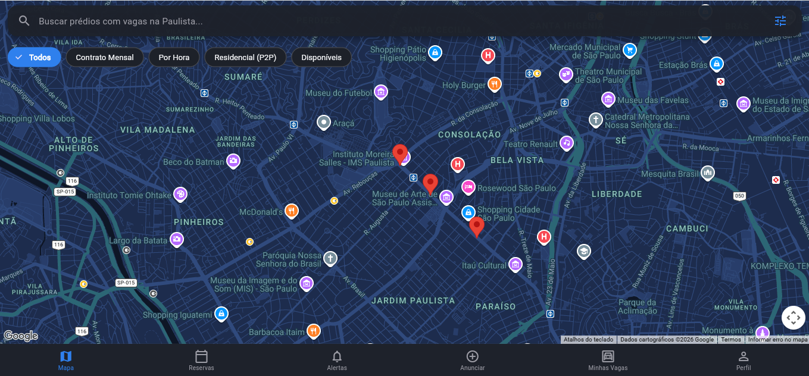
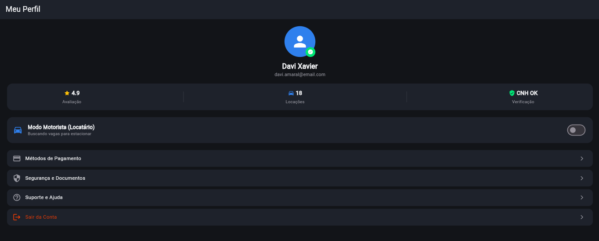

<div align="center">


# 🚗 Estacionei App — Plataforma P2P & B2C de Locação de Vagas

**[📄 Documentação completa do projeto — PDF](https://drive.google.com/file/d/1P_U64MiQz9jTvKee09QMRpmbzwuFM29i/view?hl=en)**

> Aplicativo mobile em **Flutter** para aluguel de vagas de garagem ociosas em condomínios residenciais (**P2P**) e estacionamentos rotativos (**B2C**), com foco inicial na região da **Avenida Paulista e Paraíso (São Paulo - SP)**.

</div>

---

## 📌 Visão Geral e Proposta de Valor

Muitos moradores de condomínios possuem vagas de garagem ociosas (ex: famílias com duas vagas que utilizam apenas uma, ou moradores sem veículo). Ao mesmo tempo, motoristas e trabalhadores enfrentam escassez de vagas e altos custos em estacionamentos tradicionais.

O **Estacionei** resolve essa dor conectando moradores a locatários através de **Contratos Mensais Recorrentes** e **Locações Flexíveis**, com segurança garantida para as portarias e condomínios (*Trust & Safety*).

---

## ✨ Funcionalidades Implementadas

### 🗺️ 1. Mapa Interativo & Status de Vagas (Estilo Uber / Airbnb)

<p align="center">
  
</p>

- **Tema Escuro Moderno (*Dark Map*):** Estilização customizada em JSON destacando o traçado urbano e os marcadores de vagas.
- **Semáforo de Disponibilidade:**
  - 🟢 **Verde:** Vaga disponível / Contrato mensal livre.
  - 🟡 **Amarelo:** Poucas vagas restantes (1 a 3 vagas).
  - 🔴 **Vermelho:** Vaga ocupada / Prédio lotado.
- **Filtros Rápidos em Tempo Real:** Filtragem por `Contrato Mensal`, `Por Hora`, `Residencial (P2P)` e `Apenas Disponíveis`.
- **Animação Fluida de Câmera:** Centralização e zoom suave ao selecionar qualquer ponto no mapa.

### 🏢 2. Modalidade de Contrato Mensal P2P & Rotativo

- Suporte a contratos mensais fixos com duração configurável (1, 3, 6 ou 12 meses).
- Especificação de regras de condomínio (ex: *Permite visitantes externos* vs *Apenas moradores do prédio*).
- Indicação do método de entrada:
  - QR Code digital
  - Controle remoto / Tag
  - Liberação prévia na Portaria
- Suporte a diferentes portes de veículos:
  - Compacto
  - Sedan
  - SUV
  - Motocicleta

### 🔔 3. Sistema de Fila de Espera (*Waitlist / Alertas*)

- Possibilidade de ativar alerta para prédios com status **Vermelho (Ocupado)**.
- Tela de gerenciamento de alertas ativos para cancelamento ou acompanhamento.

### ➕ 4. Anúncio de Vaga & Seletor de Ponto no Mapa

- **Formulário de Cadastro Completo (`AddSpotScreen`):** Moradores anunciam suas vagas definindo preço mensal, tempo mínimo de contrato, regras e método de acesso.
- **Geocodificação Inteligente & Seletor Visual (`LocationPickerScreen`):** Identificação de endereços reais e seletor com pino arrastável para marcar a entrada exata da garagem.
- **Gestão de Vagas Anunciadas (`MySpotsScreen`):** Painel do anfitrião para monitorar e excluir anúncios.

### 💳 5. Fluxo de Reserva & Check-in Digital

- **Checkout Dinâmico (`BookingCheckoutScreen`):** Cálculo automático de valores por meses ou horas e seleção de forma de pagamento (Pix / Cartão).
- **Passe Digital QR Code (`QRCodeCheckinScreen`):** Geração de comprovante de check-in para apresentação na portaria com horário de validade.

### 💬 6. Chat Integrado com a Portaria / Anfitrião

- Mensageria instantânea para troca de instruções de portaria, placas de veículos e entrega de controle remoto.

### 👤 7. Perfil de Usuário & Confiança (*Trust & Safety*)

<p align="center">
  
</p>

- Avaliação mútua com estrelas e histórico de locações.
- Selo de verificação de identidade / CNH.
- Alternância rápida entre **Modo Motorista (Locatário)** e **Modo Anfitrião (Locador)**.

---

## 🏗️ Arquitetura do Projeto

O projeto adota uma arquitetura modular baseada em funcionalidades (**Feature-First**):

```text
lib/
├── core/
│   ├── constants/
│   │   └── map_style.dart
│   ├── theme/
│   │   └── app_colors.dart
│   └── utils/
│       └── formatters.dart
│
├── features/
│   ├── auth/
│   │   └── presentation/
│   │       └── profile_screen.dart
│   │
│   ├── booking/
│   │   └── presentation/
│   │       ├── booking_checkout_screen.dart
│   │       ├── my_bookings_screen.dart
│   │       └── qr_code_checkin_screen.dart
│   │
│   ├── chat/
│   │   └── presentation/
│   │       └── chat_screen.dart
│   │
│   ├── map/
│   │   └── presentation/
│   │       ├── main_shell_screen.dart
│   │       ├── map_home_screen.dart
│   │       └── widgets/
│   │           ├── map_filter_chips.dart
│   │           ├── map_search_bar.dart
│   │           └── spot_details_card.dart
│   │
│   ├── spots/
│   │   ├── data/
│   │   │   └── spots_repository.dart
│   │   └── presentation/
│   │       ├── add_spot_screen.dart
│   │       ├── location_picker_screen.dart
│   │       ├── my_spots_screen.dart
│   │       └── spot_details_screen.dart
│   │
│   └── waitlist/
│       └── presentation/
│           └── my_waitlists_screen.dart
│
├── shared/
│   ├── models/
│   │   ├── booking_model.dart
│   │   ├── chat_message_model.dart
│   │   ├── parking_spot_model.dart
│   │   └── user_model.dart
│   │
│   └── widgets/
│       └── custom_button.dart
│
└── main.dart
